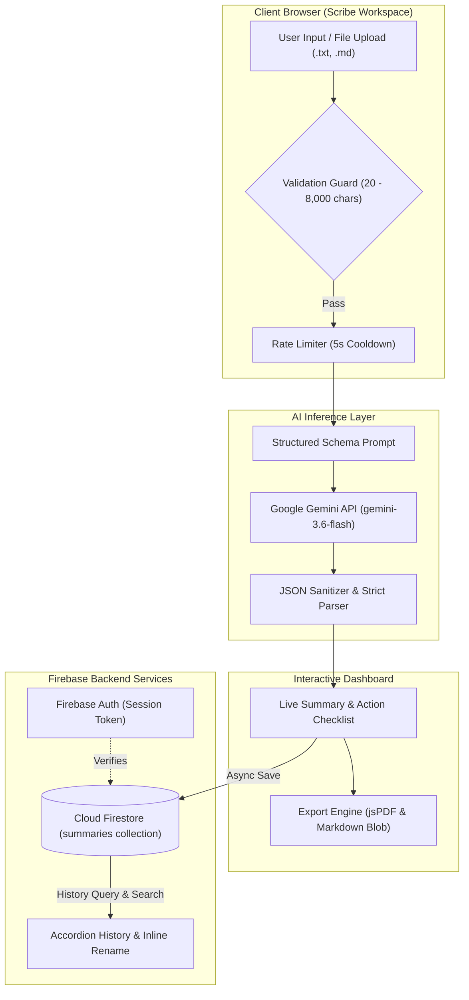

<div align="center">

  

  # Scribe

  ### AI-Powered Meeting Notes & Action-Item Extraction Platform

  [](https://developer.mozilla.org/en-US/docs/Web/JavaScript)
  [](https://tailwindcss.com/)
  [](https://firebase.google.com/)
  [](https://ai.google.dev/)
  [](https://motion.dev/)
  [](https://github.com/parallax/jsPDF)
  [](LICENSE)

  <p align="center">
    <b>Transform unstructured meeting transcripts and discussion notes into concise executive summaries and assigned action items in seconds.</b>
  </p>

  <p align="center">
    <a href="https://ai-meeting-notes-summarizer-two.vercel.app"><b>View Live Demo »</b></a> ·
    <a href="#-key-features">Key Features</a> ·
    <a href="#-tech-stack--architecture">Architecture</a> ·
    <a href="#-getting-started">Local Setup</a> ·
    <a href="#-security--privacy">Security & Privacy</a>
  </p>

</div>

---

## 📸 Interface Preview

<div align="center">
  <p><b>Executive Summary Generation & Interactive Action Items</b></p>
  
  <br/><br/>
  <p><b>Cloud History, Real-Time Search & In-Place Record Management</b></p>
  
</div>

---

## 📖 Overview

**Scribe** is an editorial-grade, privacy-conscious productivity web application engineered to eliminate the manual friction of post-meeting processing. By leveraging Google's **Gemini 3.6 Flash** large language model alongside a lightweight, reactive client architecture, Scribe distills raw, disorganized meeting transcripts into structured executive summaries and discrete, owner-assigned task checklists.

Designed with an intentional warm editorial aesthetic—featuring **Fraunces** serif headings, **Inter** body typography, and **JetBrains Mono** monospace inputs—Scribe offers a distraction-free workspace complete with smooth micro-animations, client-side rate limit guards, full-text history search, and instant PDF/Markdown exports.

---

## ✨ Key Features

### 🎙️ 1. Intelligent Transcript Distillation
* **Zero-Shot JSON Schema Inference:** Enforces strict deterministic output (`summary` narrative and `actionItems` list) without extraneous conversational filler or markdown fencing.
* **Granular Length Validation:** Real-time input boundary guardrails (20 characters minimum up to 8,000 characters maximum) prevent malformed or oversized payloads.
* **Flexible Input Methods:** Instant one-click clipboard pasting or local document upload (`.txt`, `.md`, `text/plain`, `text/markdown`) directly into the monospace editor.

### 📋 2. Action Item Extraction & Owner Detection
* **Automated Attribution:** Parses conversational context to identify assignees, defaulting reliably to `"Unassigned"` when ownership is ambiguous.
* **Interactive Completion Tracking:** Interactive checklist rows with tactile state toggling, strikethrough styling, and assignee chips.
* **One-Click Checklist Copy:** Rapidly copies formatted Markdown checklists (`- [ ] task (owner)`) ready for immediate pasting into Notion, Slack, Jira, or email.

### 🗂️ 3. Cloud Firestore History & In-Place Management
* **User-Scoped Persistence:** Automatically persists generated summaries to Cloud Firestore, indexed chronologically by `createdAt` per authenticated user.
* **Fast Debounced Search:** Client-side 150ms debounced search engine filtering instantly across summary text, task content, and team member names.
* **Inline Renaming:** Rename any summary record inline with instant local state updates and remote Firestore synchronization.
* **Safe Two-Step Deletion:** Guarded modal confirmation prevents accidental record removal while dynamically cleaning local memory cache.

### 📄 4. Multi-Format Vector & Document Export
* **Vector PDF Generation:** Generates client-side formatted A4 PDFs using **jsPDF**, complete with headers, margin calculation, word wrapping, and task checkbox glyphs.
* **Clean Markdown Export:** Downloads structured `.md` files featuring standardized heading hierarchies, metadata date slugs, and GitHub-flavored task lists.
* **Clipboard Integration:** Instant one-click copy buttons with accessible floating feedback toasts.

### 🔐 5. Authentication, Motion & Accessibility
* **Firebase Authentication:** Secure email/password login and account creation featuring an interactive five-tier password strength analyzer.
* **Session Guardrails:** Reactive `onAuthStateChanged` session observers with automatic route redirects and smooth entrance transitions.
* **Accessible Motion:** Micro-interactions built with **Motion One**, fully adhering to `prefers-reduced-motion` user preferences and WCAG `:focus-visible` standards.

---

## 🛠 Tech Stack & Architecture

### Component Architecture

| Layer | Technology | Purpose |
|---|---|---|
| **Frontend Runtime** | HTML5, Modern ES Modules, Vanilla JS | Zero-bundle-overhead, lightning-fast native browser performance |
| **Styling & Design System** | Tailwind CSS CDN + Custom CSS Tokens | Warm editorial surface styling (`#F6F5F1`), responsive split-pane layout |
| **Typography** | Fraunces, Inter, JetBrains Mono | Editorial hierarchy, readable body text, and code-friendly transcript inputs |
| **Animation & UI Polish** | Motion One & Lucide Icons | Hardware-accelerated transitions, staggered reveals, and clean iconography |
| **Authentication** | Firebase Auth (v11 Modular) | Identity management, password verification, and client route protection |
| **Database** | Cloud Firestore | Isolated multi-user document storage, compound queries, and real-time syncing |
| **AI Inference** | Google Gemini API (`gemini-3.6-flash`) | Structured JSON extraction for summarization and action task attribution |
| **Document Export** | jsPDF (v2.5) & Native Blob API | Client-side vector PDF composition and Markdown file downloads |

---

### System Architecture Flow



---

## 🚀 Getting Started

Follow these steps to run Scribe locally on your machine.

### Prerequisites

* A modern web browser (Google Chrome, Firefox, Safari, Edge)
* A static HTTP server (e.g., VS Code Live Server, Python 3, or Node `npx serve`)
* A [Google Gemini API Key](https://aistudio.google.com/)
* A [Firebase Project](https://console.firebase.google.com/) with **Email/Password Authentication** and **Cloud Firestore** enabled

---

### 1. Clone the Repository

```bash
git clone https://github.com/DushyantSingh7120/AI-Meeting-Notes-Summarizer.git
cd "AI Meeting Notes Summarizer"
```

---

### 2. Configure Environment & Credentials

Scribe keeps secret keys isolated and gitignored to prevent accidental credential leakage.

#### A. Gemini API Configuration
Copy `gemini-secret.example.js` to `gemini-secret.js` and paste your Google Gemini API key:

```bash
cp gemini-secret.example.js gemini-secret.js
```

Inside `gemini-secret.js`:
```javascript
export const GEMINI_KEY = "YOUR_ACTUAL_GEMINI_API_KEY";
```

*(Optional: Modify model version in `ai-config.js` if desired, defaults to `gemini-3.6-flash`)*

#### B. Firebase Configuration
Copy `firebase-config.example.js` to `firebase-config.js` and input your project keys:

```bash
cp firebase-config.example.js firebase-config.js
```

Inside `firebase-config.js`:
```javascript
const firebaseConfig = {
  apiKey:            "YOUR_FIREBASE_API_KEY",
  authDomain:        "YOUR_PROJECT_ID.firebaseapp.com",
  projectId:         "YOUR_PROJECT_ID",
  storageBucket:     "YOUR_PROJECT_ID.firebasestorage.app",
  messagingSenderId: "YOUR_MESSAGING_SENDER_ID",
  appId:             "YOUR_APP_ID"
};
```

---

### 3. Launch Local Static Server

Since Scribe uses native ES Modules (`import`/`export`), open the project with an HTTP server:

```bash
# Option A: Using Python 3
python -m http.server 8000

# Option B: Using Node / npx
npx serve .

# Option C: Using VS Code
# Right-click 'index.html' and select "Open with Live Server"
```

Open `http://localhost:8000` (or `http://localhost:3000` / Live Server port) in your browser.

---

## 🔒 Security & Privacy

* **Isolated User Boundaries:** Firestore queries strictly filter documents by authenticated user ID (`where("userId", "==", userId)`), ensuring users can only read, edit, or delete their own records.
* **Secret Isolation:** Local configuration files (`gemini-secret.js`, `firebase-config.js`) are gitignored with committed template examples (`.example.js`) to eliminate secret leakage in version control.
* **Referrer & Scope Restrictions:** In accordance with [SECURITY.md](SECURITY.md), production client-side keys are locked down to authorized HTTP referrers and limited strictly to the Generative Language API.
* **Rate-Limit Guardrails:** Client-side 5-second lockouts prevent accidental double-submission or rapid quota exhaustion.
* **Production Proxy Recommendation:** For enterprise multi-tenant deployments, route Gemini requests through a serverless proxy (such as Firebase Cloud Functions or an API gateway) to keep keys strictly server-side.

---

## 🤝 Contributing

Contributions, feature suggestions, and pull requests are warmly welcomed!

1. Fork the Project
2. Create your Feature Branch (`git checkout -b feature/AmazingFeature`)
3. Commit your Changes (`git commit -m 'Add some AmazingFeature'`)
4. Push to the Branch (`git push origin feature/AmazingFeature`)
5. Open a Pull Request

---

## 📄 License

Distributed under the **MIT License**. See [`LICENSE`](LICENSE) for complete details.

---

<div align="center">
  Crafted with ❤️ by <a href="https://github.com/DushyantSingh7120"><b>Dushyant Singh</b></a>
</div>
