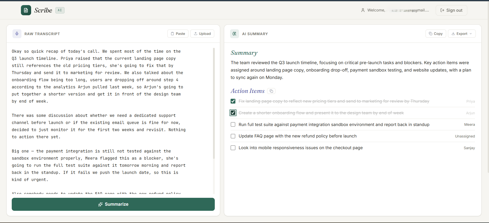
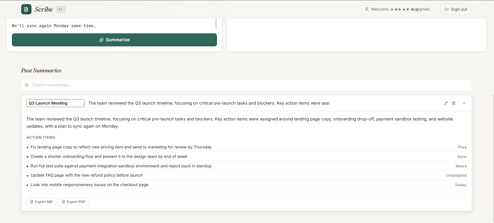

# AI Meeting Notes Summarizer
*An application for converting raw meeting transcripts into structured summaries and actionable tasks.*

**Live Demo:** [INSERT DEPLOYED URL]

## Screenshots

## What it does

This application transforms unstructured meeting notes and transcripts into clear summaries and organized action items. It solves the problem of manually reviewing raw text to extract key decisions and assign next steps after a meeting. The tool is intended for professionals and teams requiring a reliable method to process meeting records into a readable, structured format.

## Features

- User authentication
- AI-powered summarization
- Action-item extraction with owner detection
- Save, search, rename, and delete historical summaries
- Export generated content to PDF or Markdown
- Light and responsive user interface

## Tech Stack

- Frontend: HTML, JavaScript, Tailwind CSS
- Backend/Auth/DB: Firebase Authentication, Cloud Firestore
- AI: Google Gemini API
- Hosting: Firebase Hosting

## Architecture Notes

The Gemini model name is isolated into a single configuration constant to easily handle Google's frequent model deprecations. The approach to API key security is documented separately in [SECURITY.md](SECURITY.md).

## Running Locally

1. Clone the repository to your local machine.
2. Add your Firebase configuration details to the project.
3. Add your Google Gemini API key to `gemini-secret.js` (reference the `.example` file).
4. Run the application with a local HTTP server, such as Live Server or `firebase serve`.

Built by [INSERT NAME] - [INSERT LINK]
